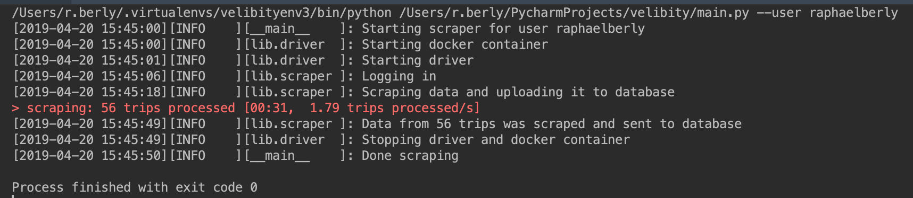

# Velibity

This tool is a web scraper used to collect Vélib data and to insert it into 
a postgres database.

## 1. Description

The scraper runs on a dockerized `Selenium` browser.  The HTML parser used is `BeautifulSoup4`. The 
parsed data is inserted into the postgres database using `psycopg2`.

Python generators are being used for efficiency and scalability. At the end of the process, insert 
queries are being grouped into small batches before being executed.


## 2. How To

### Setting things up

To get the scraper to run, you will need to have:

- A python environment (3.6+) meeting the requirements specified in the file `requirements.txt`
- A "Standalone-Chrome" selenium docker image (3.14+), with the proper name and version specified in
the driver configuration file (`conf/driver.yaml` per default). Such an image can be pulled from 
[here](https://hub.docker.com/u/selenium), or built using 
[this](https://github.com/DeinChristian/rpi-docker-selenium) for armhf (Armv7) based devices.
- A postgres database with one table, which creation SQL queries can be found in the `ddl` folder 
(`trips.sql`). The name must be matching the one in the configuration file 
`conf/scraper.yaml`
- A credentials file `conf/credentials.yaml` following the format described in 
`conf/credentials_format.yaml`


### Running the scraper

The file `main.py` may be run in order to run the scraper. It has one required argument `--user`.

Example bash command:

```bash
workon velibityenv3
python main.py --user raphaelberly
```

Example console output:


